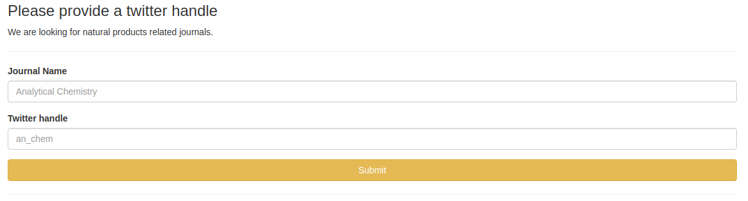

## CCBL Twitter bot 


This repository hosts the data and code for CCBL Twitter bot. The goals project is to teach the use of different tools in a interactive way, creating a twitter bot to retrieve and communicate information relevant to CCBL on twitter.

One should start by creating a twitter [app](https://developer.twitter.com/en/apps). After that a step by step learning would include:

1. Install a conda environment:

```
conda env export | grep -v "^prefix: " > environment.yml
```

Edit the .env file and load the environment

```
conda activate ccbl_twitter
python
```

2. Test the API:

After that, on python terminal, load the methods and search twitter:

```
import celery
from celery.schedules import crontab
import twitter
from api.twitter_methods import get_tweets, word_list, query_db
import json
import os
from datetime import datetime
from config.settings import ACCESS_TOKEN_KEY, ACCESS_TOKEN_SECRET, CONSUMER_KEY, CONSUMER_SECRET

api = twitter.Api(consumer_key=CONSUMER_KEY,
                  consumer_secret=CONSUMER_SECRET,
                  access_token_key=ACCESS_TOKEN_KEY,
                  access_token_secret=ACCESS_TOKEN_SECRET)

timeline = get_tweets(api, screen_name='an_chem')
timeline[0]
```

Explore other methods on api/tasks.py, api/tsv2msql.py and api/twitter_methods.py.

2. Test the Flask app:

After that get familiar with Flask [here](https://www.freecodecamp.org/news/how-to-build-a-web-application-using-flask-and-deploy-it-to-the-cloud-3551c985e492/). and then from the terminal, with the environment attached, run the Flask app:

```
gunicorn -b 0.0.0.0:5000 --access-logfile - "api.application:application"
```

You should be able to see an interface as the one in the image below clicking the url [http://0.0.0.0:5000](http://0.0.0.0:5000).




3. Test Redis and Celery:

After that get familiar with Celery [here](http://allynh.com/blog/flask-asynchronous-background-tasks-with-celery-and-redis/). Then, you should [install](https://tecadmin.net/install-redis-ubuntu/) `redis-server` in your system. Make sure redis is working by doing:

```
sudo systemctl status redis
```

Edit the code at api/tasks.py as below

```
app = celery.Celery('tasks', backend='redis://localhost:6379/0',
                    broker='redis://localhost:6379/0')

#app = celery.Celery('tasks', backend='redis://redis:6379/0',
#                broker='redis://redis:6379/0')
```

After that, in two separate terminal windows, do:


```
gunicorn -b 0.0.0.0:5000 --access-logfile - "api.application:application"
```

```
 -------------- celery@macunaima v4.3.0 (rhubarb)
---- **** ----- 
--- * ***  * -- Linux-5.0.0-27-generic-x86_64-with-debian-buster-sid 2019-09-09 16:16:50
-- * - **** --- 
- ** ---------- [config]
- ** ---------- .> app:         tasks:0x7fd819685290
- ** ---------- .> transport:   redis://localhost:6379/0
- ** ---------- .> results:     redis://localhost:6379/0
- *** --- * --- .> concurrency: 4 (prefork)
-- ******* ---- .> task events: OFF (enable -E to monitor tasks in this worker)
--- ***** ----- 
 -------------- [queues]
                .> celery           exchange=celery(direct) key=celery
```

```
gunicorn -b 0.0.0.0:5000 --access-logfile - "api.application:application"
```

```
LocalTime -> 2019-09-09 16:18:03
Configuration ->
    . broker -> redis://localhost:6379/0
    . loader -> celery.loaders.app.AppLoader
    . scheduler -> celery.beat.PersistentScheduler
    . db -> celerybeat-schedule
    . logfile -> api/logs/celery_beat.log@%WARNING
    . maxinterval -> 5.00 minutes (300s)
```

You should see the messages above printed in the terminal. If you understand the structure of the Flask app and the concept that you have a Celery beat periodic task to search twitter timelines everyday, you are ready to go to the final step, and create a Docker container.

4. Test docker and docker-compose:

Install [Docker](https://docs.docker.com/install/linux/docker-ce/ubuntu/) and [docker-compose](https://docs.docker.com/compose/install/). Take a look at an [docker-compose example](https://runnable.com/docker/python/docker-compose-with-flask-apps). 

After becoming familiar with docker-compose, edit the api/tasks.py again to:


```
#app = celery.Celery('tasks', backend='redis://localhost:6379/0',
#                    broker='redis://localhost:6379/0')

app = celery.Celery('tasks', backend='redis://redis:6379/0',
                broker='redis://redis:6379/0')
```

and do:

```
docker-compose build
```

and then

```
docker-compose up -d 
```

A nice debug resource is

```
docker ps
```

Take a look at `CONTAINER ID` and then do:


```
docker exec -it <CONTAINER ID> bash
```

